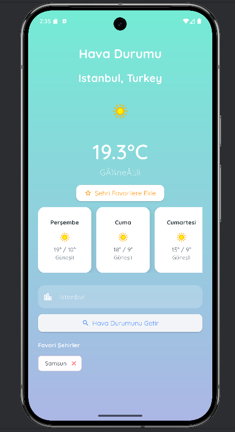

# 🌤️ Weather Forecast

A modern, clean Flutter application that displays current weather and 7-day forecast using the OpenWeatherMap API. Users can search by city name or use their current location. Favorite cities are also supported for quick access.

---

## 📱 Features

- 🔍 Search weather by city name
- 📍 Get weather based on your current location
- ⭐ Save and manage favorite cities
- 🌦️ View current weather and 7-day forecast
- 🎨 Clean UI with responsive design
- 🔄 Pull-to-refresh functionality
- 🌙 Automatic dark mode support based on time  
---

## 🚀 Installation

To run this project locally:

```bash
git clone https://github.com/zeynepsila/WeatherForecast.git
cd WeatherForecast
flutter pub get
flutter run
```

---

## 🧪 Tech Stack & Packages

| Package | Purpose |
|--------|---------|
| [`http`](https://pub.dev/packages/http) | To make HTTP requests to OpenWeatherMap API |
| [`geolocator`](https://pub.dev/packages/geolocator) | To fetch device location for location-based weather |
| [`google_fonts`](https://pub.dev/packages/google_fonts) | To use custom fonts and improve UI design |
| [`intl`](https://pub.dev/packages/intl) | For internationalization and date formatting |
---

## 🌐 API Used

- **[OpenWeatherMap API](https://openweathermap.org/api)**: Used for fetching current weather data and forecasts

---

## 🖼️ Screenshots

| Main Screen | Favorites | City Search |
|-------------|-----------|-------------|
|  |  |  |

---

## 📌 Notes

This is a personal project for improving Flutter skills and UI/UX design. Feedback and contributions are welcome!

---

## 🧑‍💻 Author

Developed by [Zeynep Sıla](https://github.com/zeynepsila)
